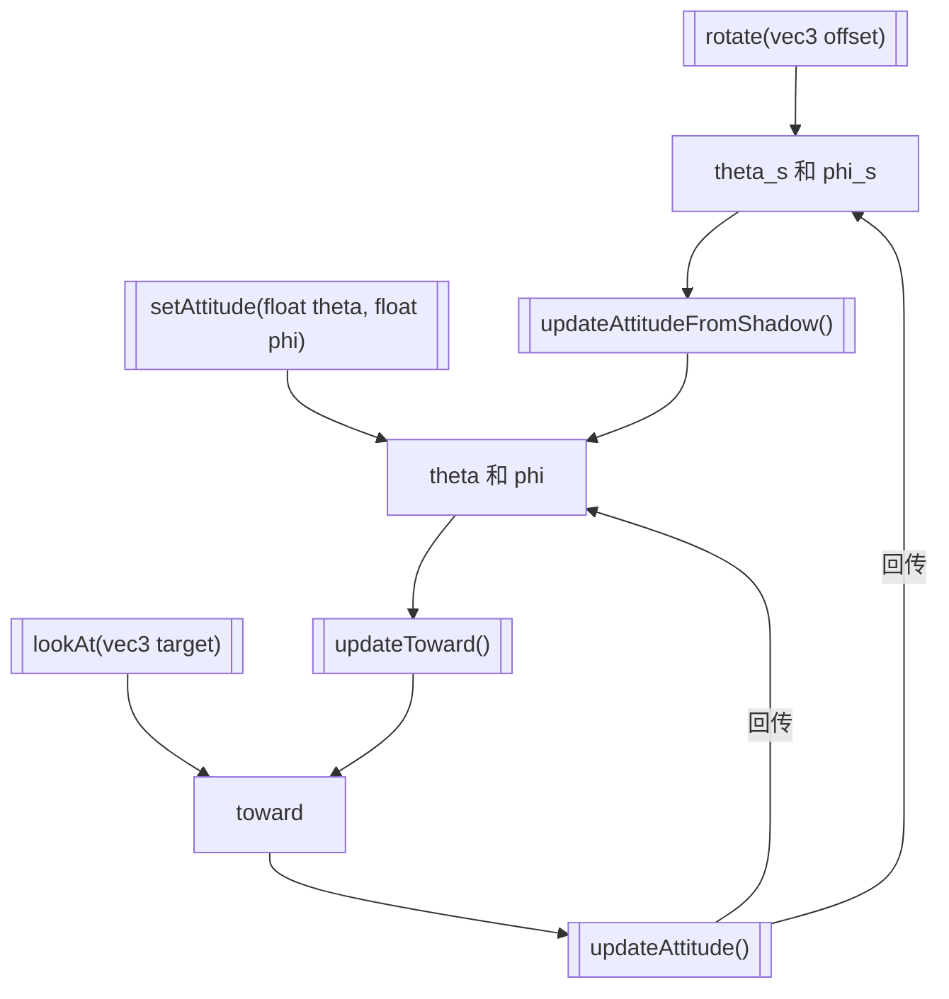
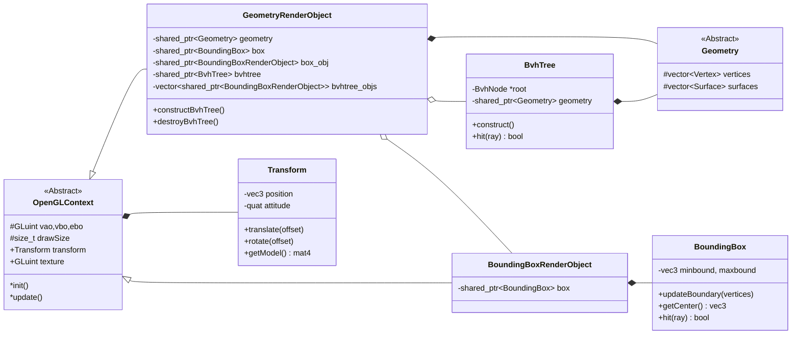
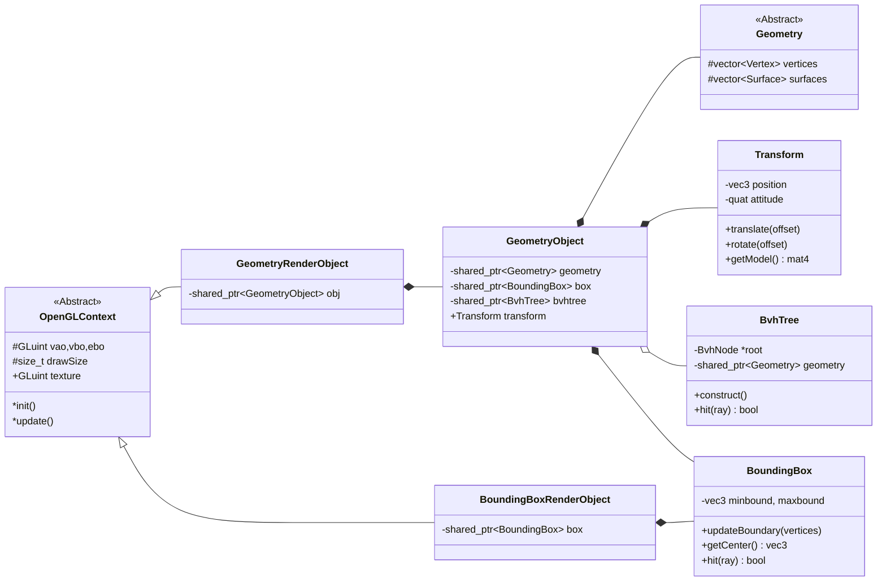
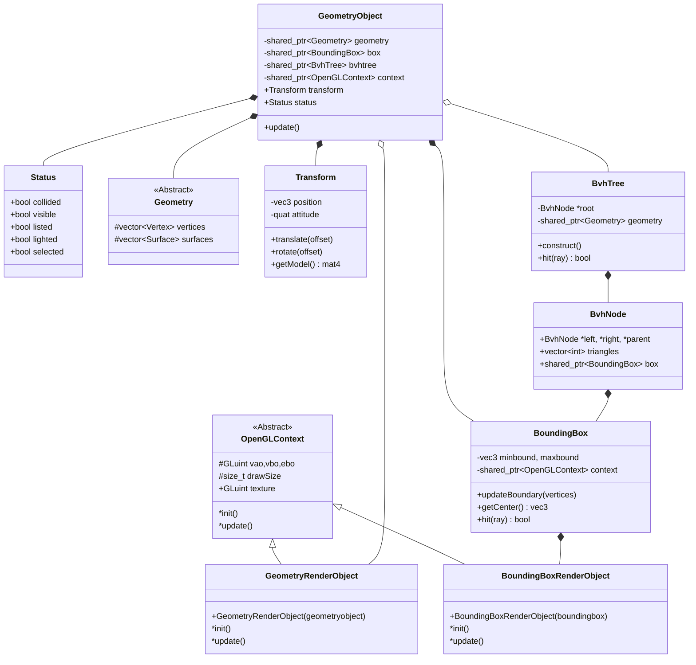

### shaders

1. default: 默认管线，拥有3个属性组“位置”、“法向量”、“颜色”、“材质坐标”，带一个材质图片
2. normal: 法向量可视化管线，顶点着色器和default基本一致，添加了几何着色器将点元发射为法向量，不做其他图元的处理
3. auxiliary: 场景辅助显示元素，渲染坐标轴、标注箭头等

9月27日：
考虑封装多Mesh组合对象的代码，具体如下
1. 删除Mesh的纯虚函数update的空实现，使得Mesh成为纯虚函数，不能直接使用 （在没对`CylinderEx`进行重构前无法实现）
2. 为Mesh实现一个迭代映射操作，对其Vertex进行变换操作，采用lambda表达式作为参数，定义为`std::function<Vertex(Vertex,float,float)>`，其中的两个`float`分别对应`updateVertex()`回调中的网格归一化坐标`u,v`，该函数命名为`transformVertex()`（完成）
3. 声明一个不可变网格类`FixedGeometry`继承自`Geometry`并且将其`update`虚方法采用空实现 （完成）
4. 实现两个`Mesh`之间的相加运算`FixedGeometry operator+(const Mesh &m1, const Mesh &m2)`，得到的`FixedGeometry`实例为两个网格的拼接，且无法对其进行更新操作（完成）

考虑增加的新特性：为`Geometry`封装一个`transform`方法，与前面的`transformVertex()`类似，但其回调函数不会包括网格归一化坐标，回调定义为`std::function<Vertex(Vertex)>`，目的是为了实现基本的空间变换操作。同时这个变换操作对继承自`Geometry`的`FixedGeometry`也是合理的

问题：在实现第5步过程中，发现问题，形体由多个Mesh子类构成，Mesh子类通过继承Mesh来具体化，由于对于`operator+()`无法进行向上转型，因此需要靠多个重载才能将所有形体之间的相加运算完全定义
解决：将重载运算符定义为Mesh的方法，但是目前不清楚如果将另一个算子定义为`const Mesh &m`会不会对Mesh的子类进行“向上转型”的操作，需要测试
测试：写了一个demo来测试可行性，实测可以正常进行向上转型操作
补充想法：也许应该将Mesh的求和重载在`FixedGeometry`上做具体实现，而将Mesh的求和重载先将两个算子构造为`FixedGeometry`，再将它们进行求和。同样的运算也可以对两个Geometry对象做，那么干脆将这个运算重载从Mesh中移除，放到Geometry中，这样相当于将这个运算从Geometry继承过来，而原本相加操作就是定义在vertices和surfaces这两个Geometry层面的成员上的，非常合理
问题：不该在Geometry上重载求和运算符返回`FixedGeometry`，这么做使得Geometry依赖于FixedGeometry，是非常不合理的
解决方案：将`operator+()`封装到Mesh中

9月28日：
1. 实现一些基于不可变网格`FixedGeometry`的多Mesh拼接的简单几何体，如`Cone`, `Cylinder` （完成，已测试）
2. 重构 `CylinderEx` 以及包括其在内的可变网格的接口设计
3. 给`Mesh`的私有属性`uNum`, `vNum`开放getter方法，并加入一个`resize(uint32_t uNum, uint32_t vNum)`更新结构，并重新生成顶点。通过缓存`updateVertex()`传入的lambda来实现 （完成，未测试）

9月29日：
实现一个与`FixedGeometry`相对应的动态网格：
1. 声明一个`MultiMeshGeometry`类，继承自`Geometry`类，其具有一个`vector<Mesh> meshes`成员
2. 重载`Mesh`的`*`运算符，与`+`不同，该运算符生成`MultiMeshGeometry`，将参与运算的`Mesh`加入到`meshes`中
3. 实现`Geometry`的虚函数`update()`，遍历`meshes`并更新所有网格，最后将它们全部拼接，来更新自己的`vertices`和`surfaces`

10月5日：
实现骨架中对每个骨骼节点姿态位置的更新计算（完成）

10月6日：
初步使用计算着色器，思考在计算着色器中实现对光的积分

11月19日：
优化Camera中的属性更新逻辑

如上图所示，多个更新方法之间存在链式调用：
1. `rotate()`在设置`theta_s`和`phi_s`之后会自动调用`updateAttitudeFromShadow()` 
2. `updateAttitudeFromShadow()`在更新`theta`和`phi`后会自动调用`updateToward()` 
3. `lookAt()`在设置`toward`后会自动调用`updateAttitude()`，
4. `updateToward()`在更新`toward`后会自动调用`updateAttitude()` 
5. `updateAttitude()`会计算姿态角并更新`theta`、`phi`、`theta_s`、`phi_s` 但不会继续调用(否则会产生递归死循环)

2025年

3月6日：

当前修改的结构为

但在经过一些思考后，发现如果能将GeometryRenderObject独立出非渲染部分的逻辑和属性，形成另一个类GeometryObject，似乎能够让结构更加清晰

进一步思考后，考虑设计为如下结构

3月19日：

考虑将LSystem和Skeleton改造为一个GeometryObject的资源

